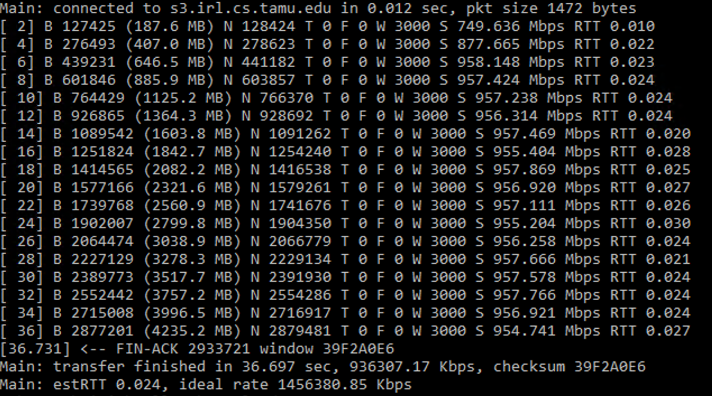

# TCP over UDP

## Overview

This is a high-performance, multithreaded network socket implementation designed for Windows environments, leveraging the Windows API to achieve near-line-rate throughput of 1 Gbps in optimal conditions.

## Key Features

- **Round Trip Time**: Accurately calculates RTO using estimated RTT, sample RTT, and deviation RTT
- **Congestion Control**: Implements flow and congestion control mechanisms
- **Multithreaded Architecture**: Uses Windows threading model for efficient packet handling
- **Sliding Window Protocol**: Implements TCP's sliding window algorithm for reliable data transfer

## Technical Details

- **Platform**: Microsoft Visual Studio
- **Synchronization**: Uses Windows synchronization primitives
  - Semaphores for flow control
  - Events for thread communication
  - Critical sections for thread-safe operations

## Performance Characteristics

- **Throughput**: Capable of sustained 1 Gbps data transfer
- **Latency Optimization**: Adaptive RTT estimation
- **Reliability**: Implements:
  - Timeout-based retransmission
  - Fast retransmit
  - Cumulative ACK

## Build Requirements

- Microsoft Visual Studio (2019 or later recommended)
- Windows SDK
- C++14 or later compiler
